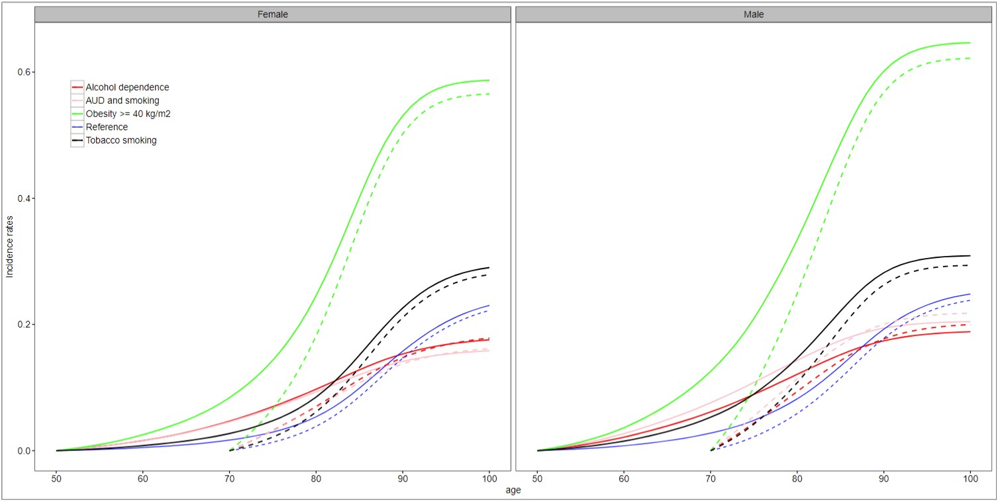

```{r setup, include = FALSE}
# Pretty much all settings are loaded except for knit options
source("R/options_visual.R")
knitr::opts_chunk$set(echo = TRUE)
```

# Introduction

Ici on essaie de répliquer les résultats obtenus par le passé sur ces données.
D'abord on estime la mortalité pour positioner la population observé par
rapport à la population générale. L'on compare également le méthode ave et
sans imputation.  Notamment sont estimés les courbes d'incidence cumulés pour
quelques pathologies.

# Loi de survie

Une première analyse consiste à estimer la mortalité de la population observée.
D'abord il faut rapeller les critères d'inclusion des individus dans l'étude
pour pouvoir positionner la loi obtenue par rapport à la loi globale.
Un individu apparait dans cette base dès lors qu'il fait un passage à l'hôpital
entre 2008 et 2013. Les individus avec des passages pour
pathologie grave en 2008 et 2009 ont été supprimés de l'étude. En tout, je pense
que la population population est quand même
étudiée en moins bonne santé que la population globale. Ainsi, je m'attend
à ce que la mortalité observée soit plus importante.

Rapelons également que deux méthodes d'identification des décès sont possibles,
avec et sans imputation. L'imputation devrai augmenter le nombre de décès 
observés. Cependant le méthode avec imputation supprime ceux qui ont été
hospitalisées avant 2013 ce qui pourrait partiellement compenser cette
augmentaiton de mortalité. Il apparait que la méthode avec imputation présente
néanmoins une mortalité plus importante.

Enfin, pour positioner la mortalité observée, elle est comparée à la table
de mortalité d'INSEE construite sur l'échantillon démographique permanent,
cf. (INSEE)[https://www.insee.fr/fr/statistiques/3311422?sommaire=3311425].
Cette dernière a été choisie pour au mieux réprésenter la population
générale de la France.

A priori, je dirrai que la mortalité observée doit être plus importante car
la population observé est passé par l'hôpital donc sera, en principe, en
moins bonne santé que la population générale.

En tout, trois tables de mortalité sont comparés :

* données imputées ;
* données non-imputées ;
* table de mortalité INSEE.


```{r compar_morta, fig.height = fig_height * 2}
tar_load(c(evenement, evenement_imput, individu, individu_imput, pathology))
id_sample <- sample(individu$id, 10e3)
evenement <- filter(evenement, id %in% id_sample)
evenement_imput <- filter(evenement_imput, id %in% id_sample)
# For smokers only cat2 counts as "smoker"
individu <- filter(individu, id %in% id_sample) %>%
    mutate(
        fdr_obesity_all = if_else(fdr_obesity_cat3 != "0", "1", "0"),
        fdr_smoker = if_else(fdr_smoker_cat3 != "2", "0", "1")
    )
individu_imput <- filter(individu_imput, id %in% id_sample) %>%
    mutate(
        fdr_obesity_all = if_else(fdr_obesity_cat3 != "0", "1", "0"),
        fdr_smoker = if_else(fdr_smoker_cat3 != "2", "0", "1")
    )

e <- ages_patho(
    individu,
    evenement,
    "STATE2_DECES",
    pathology,
    50,
    ymd("2010-01-01"),
    ymd("2013-12-31")
)

e_imput <- ages_patho(
    individu_imput,
    evenement_imput,
    "STATE2_DECES",
    pathology,
    50,
    ymd("2010-01-01"),
    ymd("2012-12-31")
)

km <- survfit(Surv(debut_obs_age, fin_obs_age, patho_obs) ~ sex, data = e)
km_imput <- survfit(Surv(debut_obs_age, fin_obs_age, patho_obs) ~ sex, data = e_imput)
```

```{r lire_table_insee}
insee_colnames <- c("age", "qx", "lx", "ex")
insee_coltypes <- c(
    age = "numeric",
    qx = "numeric",
    lx = "numeric",
    ex = "numeric"
)
insee <- c(
    H = "H - 2012_2016",
    F = "F - 2012_2016"
) %>%
    map_dfr(
        ~ suppressWarnings(read_xls(
            "data/morta_niv_2016.xls",
            sheet = .,
            range = "A9:D113",
            col_names = insee_colnames,
            col_types = insee_coltypes
        )),
        .id = "sexe"
    )
```

Pour comparer les tables je conditionne la tables INSEE à la survie jusqu'à 50
ans.

```{r}
all_tables <- bind_rows(
    obs = tidy(km),
    imput = tidy(km_imput),
    insee = insee %>%
        filter(age >= 50) %>%
        group_by(sexe) %>%
        transmute(
            time = age,
            estimate = lx / max(lx),
        ) %>%
        ungroup() %>%
        mutate(
            strata = paste0("sex=", ifelse(sexe == "F", "F", "M")),
            sexe = NULL
        ),
    .id = "table"
)
all_tables %>%
    ggplot() +
    aes(
        x = time,
        y = estimate,
        group = table,
        color = table
    ) +
    geom_step(linewidth = 0.5) +
    facet_grid(cols = vars(strata))
```


# Taux d'incidence

Je prends d'abord un exemple d'une pathologie : Insuffisance rénale chronique.
J'analyse cette pathologie dans un cadre de risques competitifs, plus
précisement je supose um modèle multi-état suivant :

```{r}
connect <- matrix(c(1, 1, 1, 0, 1, 0, 0, 0, 1), byrow = TRUE, ncol = 3)
rownames(connect) <- colnames(connect) <- c("Bonne santé", "Malade", "Mort")
statefig(c(1, 2), connect)
```

Notez que nous nous interessons pas au passage de la pathologie à la mort.

```{r}
patho_ex <- "KIDNEY1_1INSUF_CHRO"
e_patho <- ages_patho_cr(
    individu_imput,
    evenement_imput,
    c("STATE2_DECES", patho_ex),
    pathology,
    50,
    ymd("2010-01-01"),
    ymd("2012-12-31")
) %>%
    mutate(
        patho_obs = patho_obs %>%
            fct_relevel("STATE2_PDV", after = 0),
        inital = "Bonne santé"
    ) %>%
    filter(debut_obs_age < fin_obs_age)

form <- Surv(debut_obs_age, fin_obs_age, patho_obs) ~ sex + fdr_obesity_all
surv <- survfit(form, data = e_patho, id = id, istate = inital)
cox_imput <- coxph(form, data = e_patho, id = id, istate = inital)
cox_surv <- survfit(
    cox_imput,
    newdata = unique(select(e_patho, sex, fdr_obesity_all))
)
```


On peut désomrais comparer les courbes d'incidence cumulé avec les résultats
obtenus par le passé, rappelés ici par les courbes CIF pour l'insuffisance
rhénale.



Il y a des differences importantes entre les deux modèles. Le modèle utilisé
pour générer ces éstimations est un modèle de risques competitifs entre
les evenements de dépendence physique, démence, puis un certain nombre
d'autres pathologies. Alors qu'ici nous considérons que l'insuffisance rhénale
et la mort. Je m'attend ainsi à ce que le taux d'incidence estimé par nous soit
plus important que celui estimé précédamment car la pathologie etudiée est en
compétition uniquement avec la mort.

```{r}
tibble(
    time = rep(cox_surv$time, 4),
    pstate = as.vector(cox_surv$pstate[, , 2]),
    id = as.vector(col(cox_surv$pstate[, , 2]))
) %>%
    left_join(
        mutate(cox_surv$newdata, id = seq_len(n())),
        by = "id"
    ) %>%
    mutate(strata = strata(sex, fdr_obesity_all, shortlabel = FALSE)) %>%
    ggplot() +
    aes(
        x = time,
        y = pstate,
        group = fdr_obesity_all,
        color = fdr_obesity_all
    ) +
    geom_line() +
    facet_grid(col = vars(sex)) +
    expand_limits(y = 0.6) +
    scale_y_continuous(labels = percent_format()) +
    labs(y = "Probabilité d'être en état", x = "Age")
```

On peut comparer cela à un modèle non-paramétrique, qui prend chaque
groupe séparément.

```{r}
warning("CIF calculation wrong, I should get the `pstate` element.")
tidy_surv_cumhaz(surv) %>%
    filter(to == surv$states[2]) %>%
    mutate(
        sex = str_match(strata, "sex=(F|M)")[, 2],
        fdr_obesity_all = str_match(strata, "fdr_obesity_all=(0|1)")[, 2],
    ) %>%
    ggplot() +
    aes(
        x = time,
        y = 1 - exp(-cumhaz),
        group = fdr_obesity_all,
        color = fdr_obesity_all,
    ) +
    geom_line() +
    facet_grid(col = vars(sex)) +
    expand_limits(y = 0.6) +
    scale_y_continuous(labels = percent_format()) +
    labs(y = "Probabilité d'être en état", x = "Age")
```


# Covariables variables dans le temps

```{r}
events_temp <- evenement_imput %>%
    left_join(individu_imput, by = "id") %>%
    mutate(age_event = interval(date_naissance, date_event) / years(1)) %>%
    filter(
        !event %in% c(
            as.character(pathology$event[pathology$fin]),
            "STATE1_NO_PATHOL1"
        )
    )

e_patho2 <- tmerge(
    select(e_patho, id, sex, fdr_smoker),
    e_patho,
    patho_obs = event(fin_obs_age, patho_obs),
    tstart = debut_obs_age,
    tstop = fin_obs_age,
    id = id
)
e_patho2 <- tmerge(
    e_patho2,
    filter(events_temp, event == "KIDNEY1_2INSUF_AIGUE"),
    kidney_aigu = tdc(age_event),
    id = id
)
e_patho2 <- tmerge(
    e_patho2,
    filter(events_temp, event == "STATE1_DEP_PHYSIQUE"),
    dep_phys = tdc(age_event),
    id = id
)
cox_dyn <- coxph(
    Surv(tstart, tstop, patho_obs) ~ sex + fdr_smoker + dep_phys + kidney_aigu,
    data = e_patho2,
    id = id
)
print(cox_dyn)
```